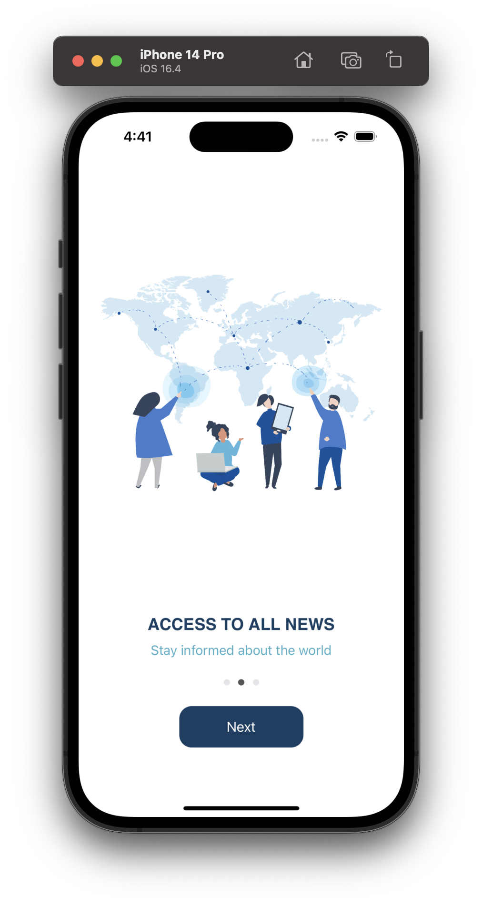
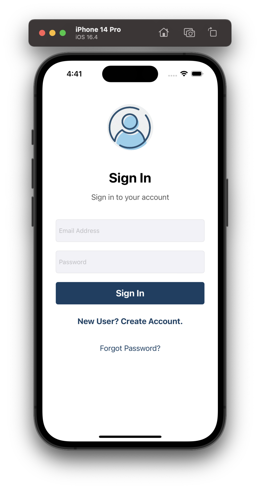
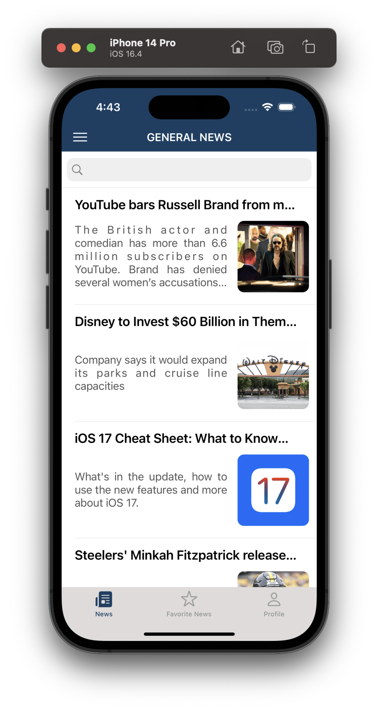
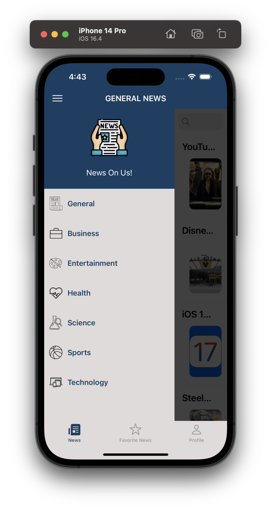
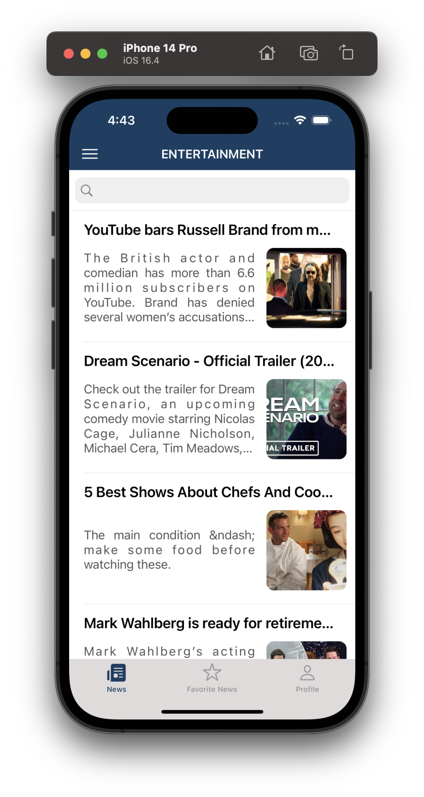
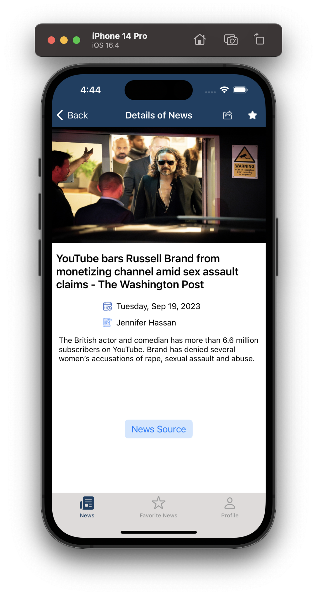
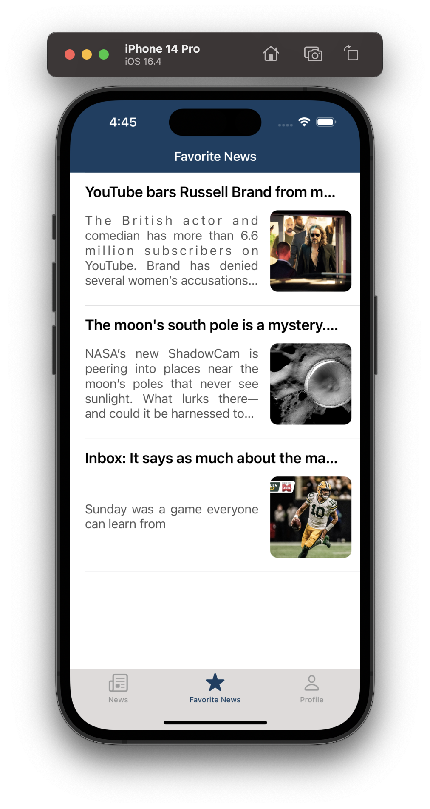
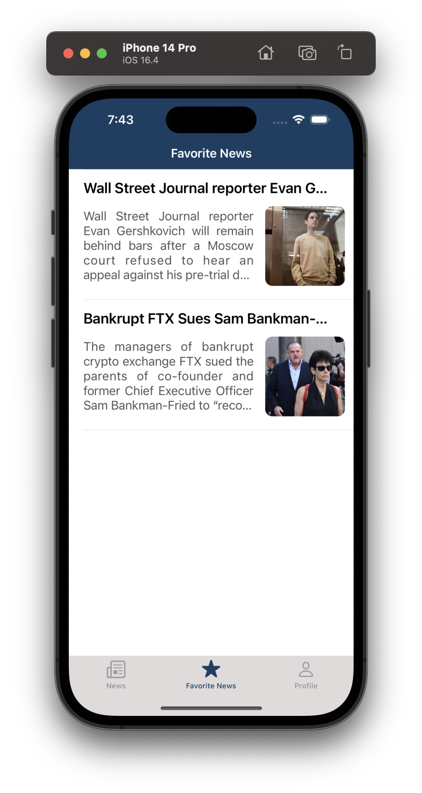
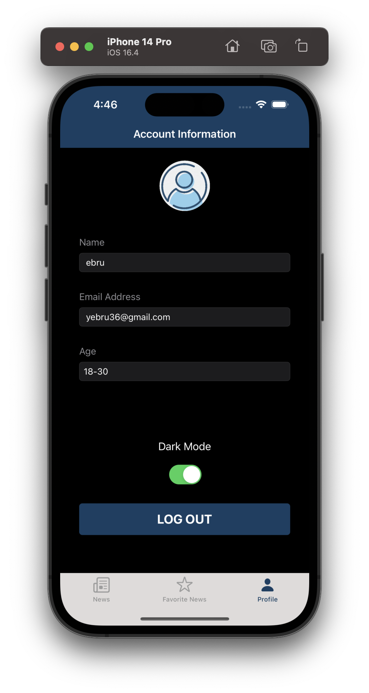

# NewsOnUs-NewsApiApp
Technologies Used in the News On Us! (NewsApi)
* UITableView
* UICollectionView
* User Defaults
* Firebase Authentication
* Alamofire
* King Fisher
* MVVM Architecture
* UIKit
* Custom Side Menu

  
  
  
  
  
  
  
  

- Onboarding Screen 
- User Login
- Listing the News
- Side Menu
- Choose a news category
- Searching in news

- Accessing the detail page of the news
- Sharing relevant news on the  detail page
- Go to the link of the relevant news on the detail page

- Adding the news to favorite page
- Listing favorite news on the favorite page
- Accessing the detail page of the favorite news

- View profile page
- Set dark mode on profile page
- Log Out

- Showing each user's favorite news separately for different users

